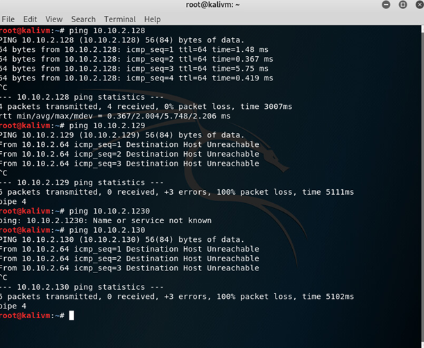

## Event 1
The  Red vs Blue event took place on Monday 26/10/2020. During this event, the red teamers attacked the applications built by the security engineers. The Blue teamers were tasked with intercepting and identifying the attacks carried out by the red team. As a red teamer I had to run a number of tests to try and find vulnerabilities inside the applications.

As the event started there was some confusion as to how the red team will organize itself as the teachers did not take any responsibility for this. As such some of the students created a Dicord  channel where we divided the applications among the teams that we formed. I joined team 5.

The event was split into 3 parts the first one in the morning until 11:45 where we were allowed to attack the machines. Sadly during this part I was not able to connect to my Seclab account due to probably someone else changing my password. In the end I talked with one of my teammates and I ended up using his account to create a kali machine inside the VLAN that the target machines were deployed in.

### Applications to test

`Realtime Message Web Application
10.10.1.114 
1472_Client1-VLAN
Authentication(2FA), session-based attacks, input-filtering, retrieving others private messages/data
User account can be created. Admin functionality not yet added`

`An online banking application
10.10.2.128-.130
input filtering, password encryption, authentication
test account             username: test            password: testing
1473_Client2-VLAN`

`Security camera application
10.10.2.137 - 139
1473_Client2-VLAN
Input filtering, authentication (if implemented on time), MITM, testing encryption
Accounts not yet implemented, if needed can be implemented before event`

### Security camera application

We could not find any information on the security camera as we found no systems or web services running other than MySQL.

Using nmap we find that the machine at  10.10.2.138 has port 3306 (MySql) database open. We did not research any further since we had no idea what it was used for.

### An online Bancking Applicaiton 

For the second testing period of the event I had my system up and running and I was mainly occupied with testing the Banking Application.

In the limited time that I had these were the insights I was able to make.

#### [Figure 2.1 - Determening active ip] 

Out of the 3 supplied IPs the only one reachable was 128, we believe this was because the other 2 were down. Next time mark them as down or try to set them up in the Test Objectives.

#### [Figure 2.2 - Initial machine scan] 

 The initial nmap revealed port 80 and port 8081 - From a first look Apache is version  2.4.41 which comes with some vulnerabilities.

#### [Figure 2.3 - Vulnerabilities tied to Apache] 

There are known vulnerabilities for that version of apache including information disclosure and possible Remote Code execution. 

#### [Figure 2.4 - ApachePossible Vulnerability] 

While no Proof of Concept was found for the apache a number of vulnerabilites where found on the offcial page for Apache CVEs.

#### [Figure 2.5 - Multi Factor Authentification missing] 

There is no functionality to register and login with multi factor authentication which increases users security.

Beforehand, we were supplied with credentials that would grant us access to the website.
While using these credentials we have noticed that the login did not work, even if we got a successful request as it can be seen below.

#### [Figure 2.6 - Portal broken] 

From talking with the creator and from the message given we realised that the backend is not properly configured and therefore any vulnerabilities on port 8081 could not be tested. 

But we believe after fixing this some other things to look into are disallowing the PUT and DELETE methods. Also the icon gives away that the website is using the Angular framework.

#### [Figure 2.7 - Vulnerabilities left open] 

#### [Figure 2.8 - Attempt to exploit PUT DELETE vulnerability] 

Sensitive information is visible in the  request and the website doesn’t force https making it possible for this information to be intercepted using a man in the middle attack. 

(Un)Fortunately, these fields were not vulnerable to SQL injection. This was checked using SQLmap. 

### Group report and presentation

For the last stage of the event the teams were required to present their findings. To this end we created a document with our findings and a group report. As most of the findings we had were the accomplishment of the group we decided to state our work as such. These findings can be found in the [group document](https://docs.google.com/document/d/1rLfha397ISHSdsXsOmb3bVRcS5ejauKUF-q4mHzbsIg/edit#) and the [group presentation](https://docs.google.com/presentation/d/1e0r3fgg7E5uUCzh1KgLpszqBzHL6_j9aalGyg7PmM0k/edit#slide=id.ga50b1d7492_6_2)

